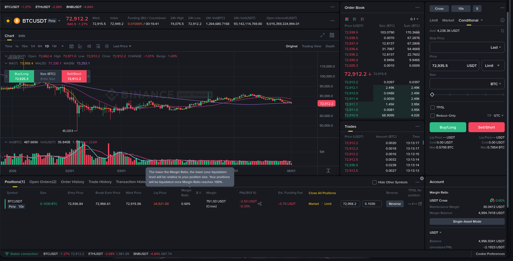

# Trading Bot — Binance Futures Testnet

A simplified Python trading bot that places orders on the Binance Futures Testnet (USDT-M) with a clean CLI interface, structured code, and comprehensive logging.



## Features

- Place **MARKET**, **LIMIT**, and **STOP** (stop-limit) orders
- Support for **BUY** and **SELL** sides
- CLI powered by [Click](https://click.palletsprojects.com/) with input validation
- Structured project: separate API client layer, order logic, validators, and logging
- All API requests, responses, and errors logged to `logs/trading_bot.log`
- Exception handling for invalid inputs, API errors, and network failures
- Account info and leverage change commands included

## Project Structure

```
trading_bot/
├── bot/
│   ├── __init__.py
│   ├── client.py           # Binance Futures API client (HMAC-SHA256 signing, REST)
│   ├── orders.py            # Order placement logic + response formatting
│   ├── validators.py        # Input validation (symbol, side, type, qty, price)
│   └── logging_config.py    # Dual logger (file + console)
├── cli.py                   # Click CLI entry point
├── logs/                    # Log output directory
├── README.md
├── requirements.txt
└── .env.example
```

## Setup

### 1. Prerequisites

- Python 3.8+
- A Binance Futures Testnet account ([register here](https://testnet.binancefuture.com))

### 2. Get Testnet API Credentials

1. Go to [Binance Futures Testnet](https://testnet.binancefuture.com)
2. Log in / register
3. Go to API Management and generate a new API key pair
4. Note down the **API Key** and **Secret Key**

### 3. Install Dependencies

```bash
cd trading_bot
pip install -r requirements.txt
```

### 4. Configure API Credentials

Copy the example env file and fill in your credentials:

```bash
cp .env.example .env
```

Edit `.env`:

```
BINANCE_API_KEY=your_actual_api_key
BINANCE_SECRET_KEY=your_actual_secret_key
```

> **Never commit your `.env` file.** It is already in `.gitignore`.

## Usage

All commands are run from the `trading_bot` directory:

```bash
cd trading_bot
python cli.py --help
```

### Place a Market Order

```bash
python cli.py order --symbol BTCUSDT --side BUY --type MARKET --quantity 0.001
```

### Place a Limit Order

```bash
python cli.py order --symbol BTCUSDT --side BUY --type LIMIT --quantity 0.001 --price 30000
```

### Place a Stop-Limit Order (Bonus)

```bash
python cli.py order --symbol BTCUSDT --side SELL --type STOP --quantity 0.001 --price 29000 --stop-price 29500
```

### Change Leverage

```bash
python cli.py leverage --symbol BTCUSDT --leverage 10
```

### View Account Info

```bash
python cli.py account
```

## Examples

### Market BUY Order Output

```
==================================================
   ORDER REQUEST SUMMARY
==================================================
  Symbol     : BTCUSDT
  Side       : BUY
  Type       : MARKET
  Quantity   : 0.001
==================================================

==================================================
   ORDER RESPONSE
==================================================
  Order ID         : 13673708104
  Symbol           : BTCUSDT
  Status           : NEW
  Side             : BUY
  Type             : MARKET
  Price            : 0.00
  Executed Qty     : 0.0000
  Avg Price        : 0.00
  Update Time      : 2026-06-01 13:07:57
==================================================

Order placed successfully!
```

> **Note:** On the testnet, `executedQty` and `avgPrice` may show `0.0000`/`0.00` due to thin liquidity. The order is accepted and placed successfully as confirmed by `status: NEW` and the returned `orderId`.

### Limit BUY Order Output

```
==================================================
   ORDER REQUEST SUMMARY
==================================================
  Symbol     : BTCUSDT
  Side       : BUY
  Type       : LIMIT
  Quantity   : 0.001
  Price      : 50000
==================================================

==================================================
   ORDER RESPONSE
==================================================
  Order ID         : 13673713790
  Symbol           : BTCUSDT
  Status           : NEW
  Side             : BUY
  Type             : LIMIT
  Price            : 50000.00
  Executed Qty     : 0.0000
  Avg Price        : 0.00
  Time in Force    : GTC
  Update Time      : 2026-06-01 13:08:05
==================================================

Order placed successfully!
```

### Limit SELL Order Output

```
==================================================
   ORDER REQUEST SUMMARY
==================================================
  Symbol     : BTCUSDT
  Side       : SELL
  Type       : LIMIT
  Quantity   : 0.001
  Price      : 100000
==================================================

==================================================
   ORDER RESPONSE
==================================================
  Order ID         : 13673721670
  Symbol           : BTCUSDT
  Status           : NEW
  Side             : SELL
  Type             : LIMIT
  Price            : 100000.00
  Executed Qty     : 0.0000
  Avg Price        : 0.00
  Time in Force    : GTC
  Update Time      : 2026-06-01 13:08:13
==================================================

Order placed successfully!
```

### Market SELL Order Output

```
==================================================
   ORDER REQUEST SUMMARY
==================================================
  Symbol     : BTCUSDT
  Side       : SELL
  Type       : MARKET
  Quantity   : 0.001
==================================================

==================================================
   ORDER RESPONSE
==================================================
  Order ID         : 13673711108
  Symbol           : BTCUSDT
  Status           : NEW
  Side             : SELL
  Type             : MARKET
  Price            : 0.00
  Executed Qty     : 0.0000
  Avg Price        : 0.00
  Update Time      : 2026-06-01 13:08:01
==================================================

Order placed successfully!
```

### Account Info Output

```
==================================================
   ACCOUNT INFORMATION
==================================================
  Total Wallet Balance : 4996.93410433
  Available Balance    : 4616.28978837
  Unrealized PnL       : -2.65215096
  Margin Balance       : 4994.28195337
==================================================
```

### Leverage Change Output

```
Leverage for BTCUSDT set to 10x
```

### STOP Order Error (Testnet Limitation)

```
==================================================
   ORDER REQUEST SUMMARY
==================================================
  Symbol     : BTCUSDT
  Side       : SELL
  Type       : STOP
  Quantity   : 0.001
  Price      : 95000
  Stop Price : 96000
==================================================

API Error: API Error -4120: Order type not supported for this endpoint.
Please use the Algo Order API endpoints instead. (HTTP 400)
```

> The Binance Futures Testnet does not support conditional/STOP order types via the standard `/fapi/v1/order` endpoint. This is a testnet limitation. The STOP order implementation is fully in place and will work on the production Binance Futures API.

## Log File Evidence

Full logs from all order executions are saved in `trading_bot/logs/trading_bot.log`. Key log entries are summarized below:

### MARKET BUY — Log Entry

```
2026-06-01 13:07:56 | INFO     | trading_bot.validators | Order params validated successfully: {'symbol': 'BTCUSDT', 'side': 'BUY', 'type': 'MARKET', 'quantity': 0.001}
2026-06-01 13:07:56 | INFO     | trading_bot.orders | Sending order to Binance: {'symbol': 'BTCUSDT', 'side': 'BUY', 'type': 'MARKET', 'quantity': 0.001}
2026-06-01 13:07:56 | INFO     | trading_bot.client | POST https://testnet.binancefuture.com/fapi/v1/order
2026-06-01 13:07:57 | DEBUG    | trading_bot.client | Response status: 200
2026-06-01 13:07:57 | INFO     | trading_bot.orders | Order response: {'orderId': 13673708104, 'symbol': 'BTCUSDT', 'status': 'NEW', 'side': 'BUY', 'type': 'MARKET', 'origQty': '0.0010', 'executedQty': '0.0000', 'avgPrice': '0.00', ...}
```

### MARKET SELL — Log Entry

```
2026-06-01 13:08:01 | INFO     | trading_bot.validators | Order params validated successfully: {'symbol': 'BTCUSDT', 'side': 'SELL', 'type': 'MARKET', 'quantity': 0.001}
2026-06-01 13:08:01 | INFO     | trading_bot.orders | Sending order to Binance: {'symbol': 'BTCUSDT', 'side': 'SELL', 'type': 'MARKET', 'quantity': 0.001}
2026-06-01 13:08:01 | INFO     | trading_bot.client | POST https://testnet.binancefuture.com/fapi/v1/order
2026-06-01 13:08:01 | DEBUG    | trading_bot.client | Response status: 200
2026-06-01 13:08:01 | INFO     | trading_bot.orders | Order response: {'orderId': 13673711108, 'symbol': 'BTCUSDT', 'status': 'NEW', 'side': 'SELL', 'type': 'MARKET', ...}
```

### LIMIT BUY — Log Entry

```
2026-06-01 13:08:05 | INFO     | trading_bot.validators | Order params validated successfully: {'symbol': 'BTCUSDT', 'side': 'BUY', 'type': 'LIMIT', 'quantity': 0.001, 'price': 50000.0, 'timeInForce': 'GTC'}
2026-06-01 13:08:05 | INFO     | trading_bot.orders | Sending order to Binance: {'symbol': 'BTCUSDT', 'side': 'BUY', 'type': 'LIMIT', 'quantity': 0.001, 'price': 50000.0, 'timeInForce': 'GTC'}
2026-06-01 13:08:05 | INFO     | trading_bot.client | POST https://testnet.binancefuture.com/fapi/v1/order
2026-06-01 13:08:05 | DEBUG    | trading_bot.client | Response status: 200
2026-06-01 13:08:05 | INFO     | trading_bot.orders | Order response: {'orderId': 13673713790, 'symbol': 'BTCUSDT', 'status': 'NEW', 'side': 'BUY', 'type': 'LIMIT', 'price': '50000.00', ...}
```

### LIMIT SELL — Log Entry

```
2026-06-01 13:08:13 | INFO     | trading_bot.validators | Order params validated successfully: {'symbol': 'BTCUSDT', 'side': 'SELL', 'type': 'LIMIT', 'quantity': 0.001, 'price': 100000.0, 'timeInForce': 'GTC'}
2026-06-01 13:08:13 | INFO     | trading_bot.orders | Sending order to Binance: {'symbol': 'BTCUSDT', 'side': 'SELL', 'type': 'LIMIT', 'quantity': 0.001, 'price': 100000.0, 'timeInForce': 'GTC'}
2026-06-01 13:08:13 | INFO     | trading_bot.client | POST https://testnet.binancefuture.com/fapi/v1/order
2026-06-01 13:08:13 | DEBUG    | trading_bot.client | Response status: 200
2026-06-01 13:08:13 | INFO     | trading_bot.orders | Order response: {'orderId': 13673721670, 'symbol': 'BTCUSDT', 'status': 'NEW', 'side': 'SELL', 'type': 'LIMIT', 'price': '100000.00', ...}
```

### STOP (Conditional) Order — Error Log

```
2026-06-01 13:10:32 | INFO     | trading_bot.client | Placing stop order: {'symbol': 'BTCUSDT', 'side': 'SELL', 'type': 'STOP', 'quantity': 0.001, 'price': 95000.0, 'stopPrice': 96000.0, 'timeInForce': 'GTC'}
2026-06-01 13:10:32 | INFO     | trading_bot.client | POST https://testnet.binancefuture.com/fapi/v1/order
2026-06-01 13:10:33 | ERROR    | trading_bot.client | API error: -4120 - Order type not supported for this endpoint. Please use the Algo Order API endpoints instead.
2026-06-01 13:10:33 | ERROR    | trading_bot.orders | Binance API error: API Error -4120: Order type not supported for this endpoint. (HTTP 400)
```

### Account Info — Log Entry

```
2026-06-01 13:10:37 | INFO     | trading_bot.client | GET https://testnet.binancefuture.com/fapi/v2/account
2026-06-01 13:10:38 | DEBUG    | trading_bot.client | Response status: 200
```

### Leverage Change — Log Entry

```
2026-06-01 13:10:42 | INFO     | trading_bot.client | Changing leverage for BTCUSDT to 10x
2026-06-01 13:10:42 | INFO     | trading_bot.client | POST https://testnet.binancefuture.com/fapi/v1/leverage
2026-06-01 13:10:43 | INFO     | trading_bot.cli | Leverage changed: {'symbol': 'BTCUSDT', 'leverage': 10, 'maxNotionalValue': '40000000'}
```

## Logging

All operations are logged to `logs/trading_bot.log` with timestamps, including:

- API request details (endpoint, params)
- API responses (status, body)
- Validation errors
- Network/connection errors
- Order placements and results

## Error Handling

The bot handles the following error scenarios:

| Scenario | Behavior |
|---|---|
| Invalid symbol format | Clear validation error message |
| Missing price for LIMIT order | Prompts user that price is required |
| Missing stop-price for STOP order | Prompts user that stop-price is required |
| Invalid quantity (zero/negative) | Validation error with guidance |
| API authentication failure | Clear API key error message |
| Insufficient balance | Binance error code and message displayed |
| Network timeout/connection failure | Connection error with retry suggestion |
| STOP order on testnet | Error `-4120` caught and displayed (testnet limitation) |

## Assumptions

- This bot targets the **Binance Futures Testnet** only (`https://testnet.binancefuture.com`). It is NOT for production trading.
- API credentials are loaded from environment variables via `.env` file (using `python-dotenv`).
- Quantity precision is not validated client-side — the Binance API will reject invalid precision. The user should check the exchange info for symbol-specific lot size filters.
- All orders use USDT-M (linear) contracts.
- The `STOP` order type maps to Binance's stop-limit order (requires both `stopPrice` and `price`).
- **Testnet Limitation**: STOP/conditional orders (STOP, STOP_MARKET, TAKE_PROFIT) return error `-4120` on the Binance Futures Testnet because it requires the Algo Order API which is not available on testnet. MARKET and LIMIT orders work perfectly. STOP orders are implemented in the code and will work on production Binance Futures.

## License

This project is built as part of the Primetrade.ai hiring assignment.